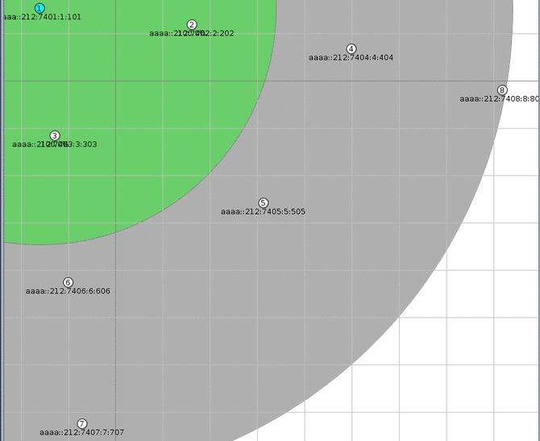
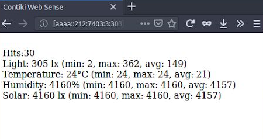

# Sky-Measurements-Broadcast

A Contiki program for Sky Tmote where each node broadcasts and receives its measurements (light, temperature, humidity & solar) to its neighbors and presents current, min, max and average readings on the browser (`rpl-border-router/border-router.c` needed).

The source file must be put under the `contiki/examples/ipv6/sky-websense` directory.

### Output example
#### Cooja

#### Browser

Tested on **Contiki 2.7**.
